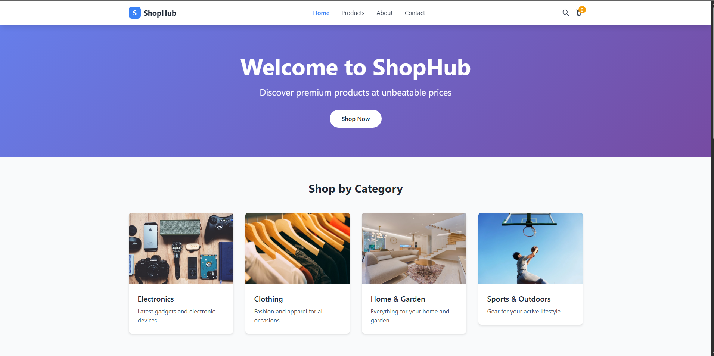
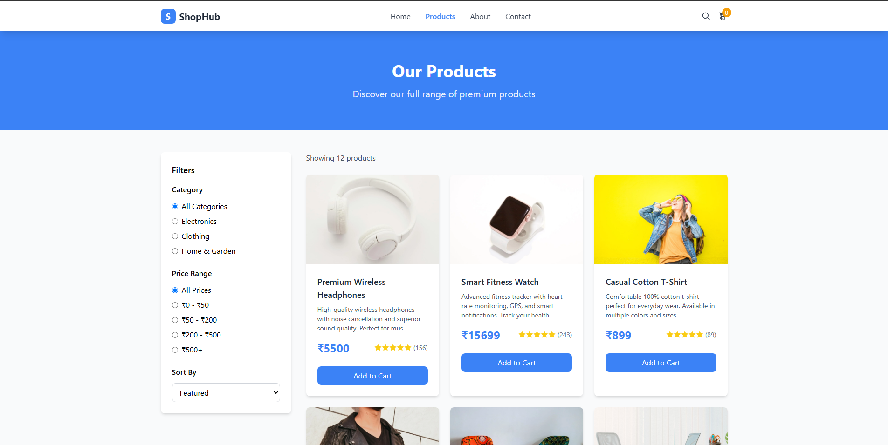
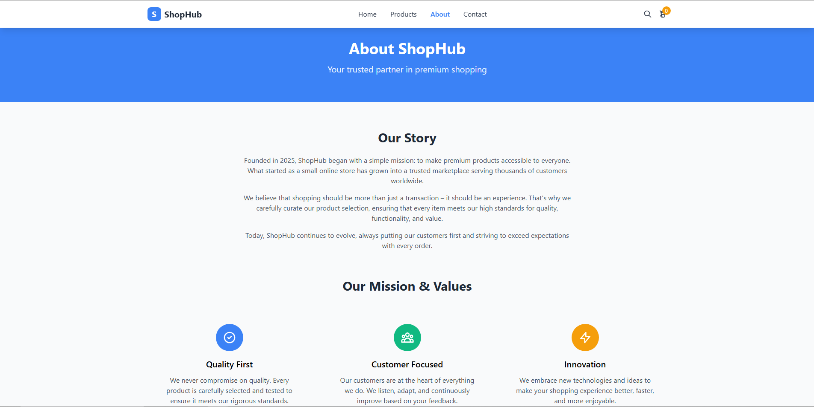
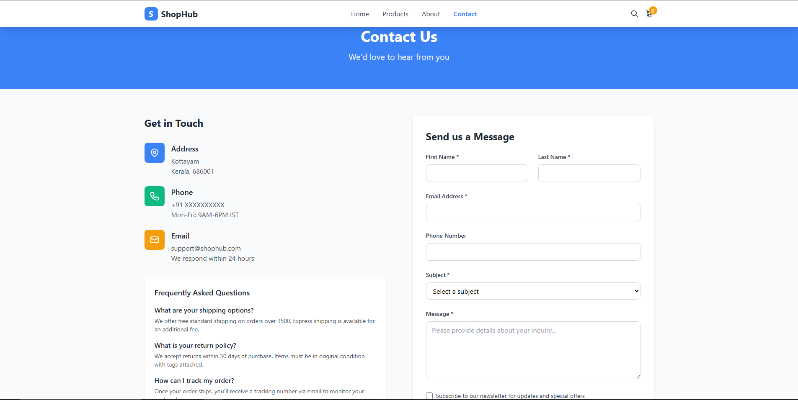
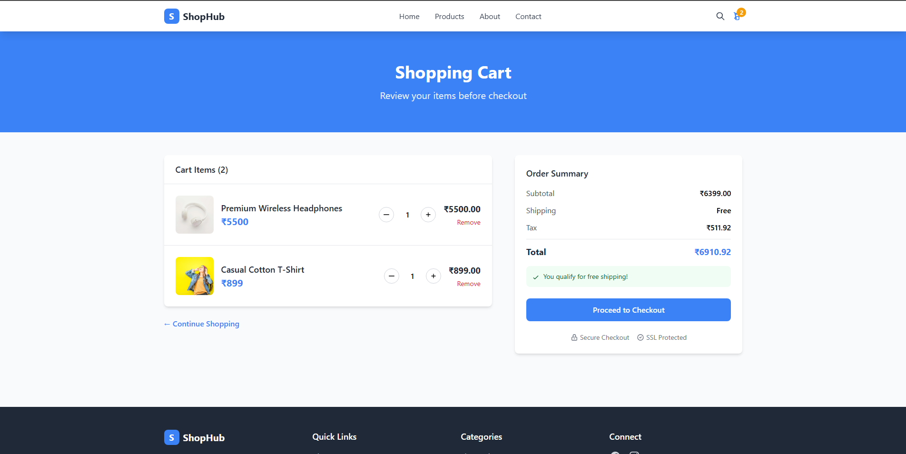
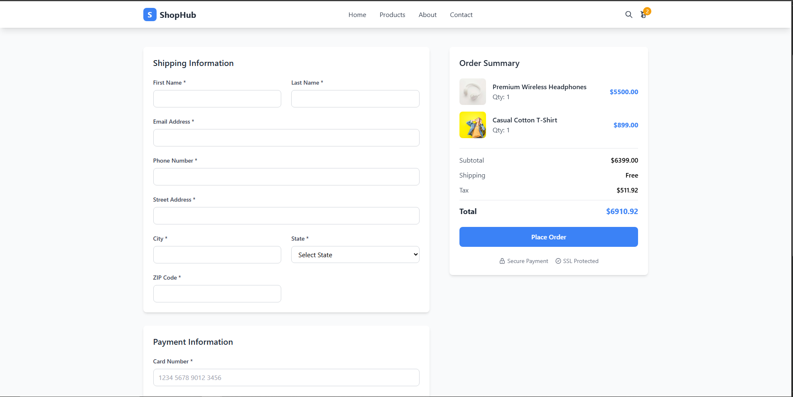

# 🛍️ ShopHub
**ShopHub** is a fully responsive e-commerce website built using **HTML**, **Tailwind CSS**, and **JavaScript**. It features dynamic product loading, category filtering, a shopping cart, checkout flow, and modern UI components for a smooth online shopping experience.

## ⚙️ Features

- 🛒 Add/remove items to cart
- 📦 Dynamic product listing
- 🧠 Intelligent category and price filters
- ✅ Checkout and order confirmation flow
- 📱 Fully responsive layout (Tailwind CSS)
- 🔍 Search functionality
- 💬 Contact form and About page

## 🛠️ Tech Stack
- HTML5
- Tailwind CSS
- JavaScript (ES6)
- GitHub Pages (for hosting)

## ✨ Contribution
Currently, this project is a solo build. Feel free to fork it and customize your own version!

## 🖼️ Screenshots

### 🏠 Homepage

### 🛍️ Product Listing

### ℹ️ About Us

### 📞 Contact Us

### 🛒 Shopping Cart

### 💳 Payment Gateway

